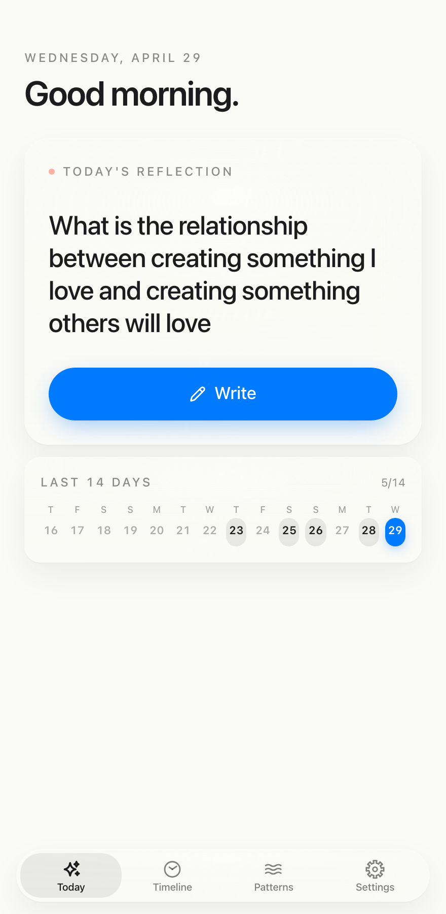
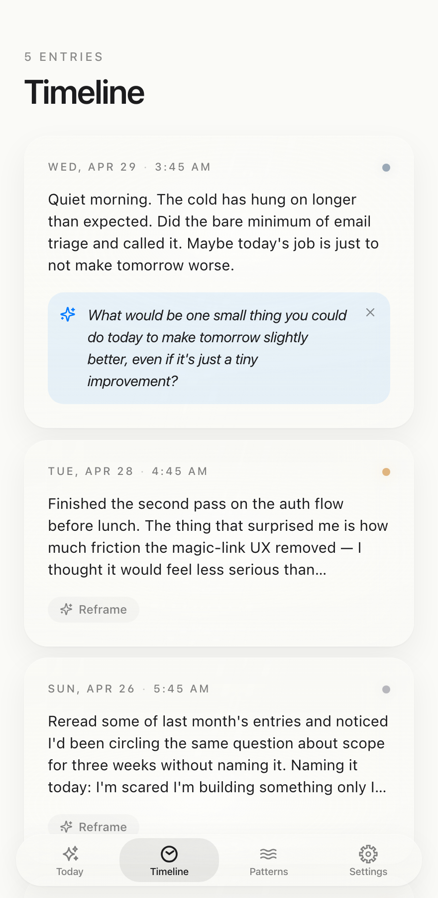
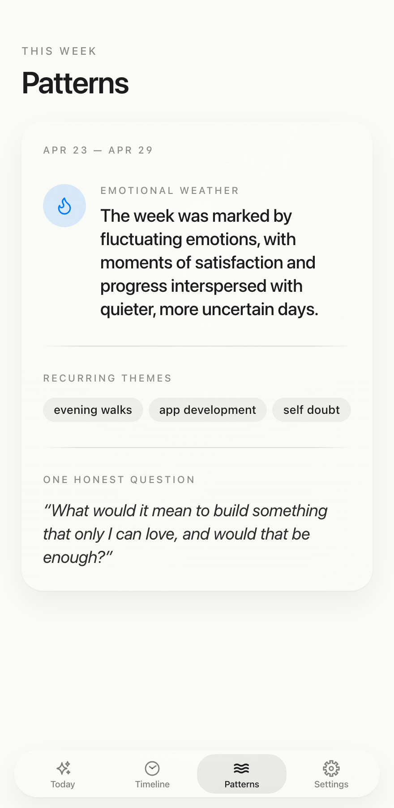
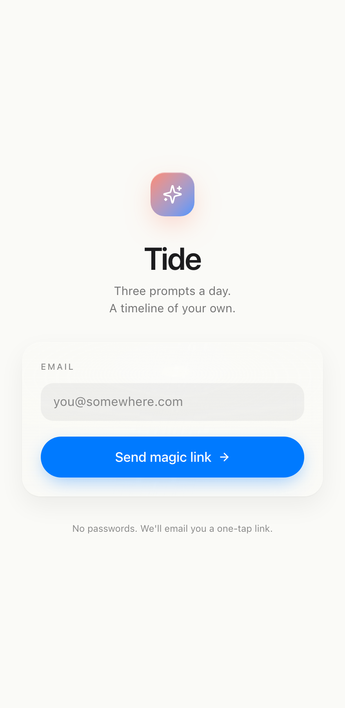
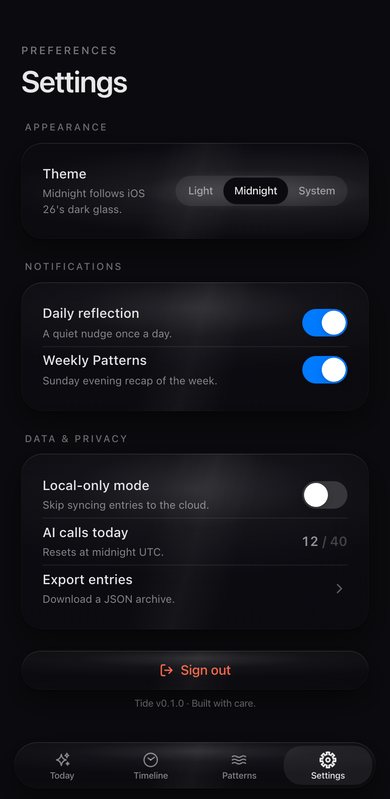

# Tide

A browser-native reflection app that feels like a first-party iOS Journal competitor. Three AI-assisted prompts a day, a glass-card timeline of past entries, and a weekly Patterns synthesis that surfaces themes and reframing questions. Built around the iOS 26 Liquid Glass design language — the goal is the cognitive double-take where a glance makes you assume it's a Swift app.

## Screenshots

| Today | Timeline | Patterns |
| --- | --- | --- |
|  |  |  |

| Login | Settings (Midnight mode) |
| --- | --- |
|  |  |

## What's interesting under the hood

- **Liquid Glass material** — custom `.liquid-glass` CSS layer with `@property`-registered animatable custom properties driving a cursor-tracking specular highlight on every card and a scroll-driven highlight on Timeline rows that mimics the iOS 26 Lock Screen clock's response to environmental motion.
- **Concentric corners** per Apple's 2025 HIG: outer card 24px / inner card 16px, with the inner radius pre-tuned for the default 8px padding.
- **Three AI actions, not a chat box** — `generatePrompt` (last 10 entries → one fresh question), `weeklyPatterns` (7-day synthesis with 24h Upstash cache), `reframe` (single-entry alt-angle question). All on Groq Llama 3.3 70B with Qwen3 32B as automatic fallback.
- **Defense in depth on AI calls** — Upstash sliding-window rate limits per the spec quotas (6/min for prompt, 10/hr for reframe, 2/hr for weekly), plus a Postgres-side daily-cap function `bump_ai_call_counter` that no client can bypass even via VPN-hopping.
- **Auth: magic links only** — no passwords. `@supabase/ssr` handles session cookies; middleware refreshes them on every request.
- **iOS-style motion** — every interaction uses motion/react with `spring(stiffness: 400, damping: 30)`, the curve that makes interactions feel 120Hz-native.
- **Local-first feel** — all four tabs are server-rendered with `force-dynamic`, `revalidatePath` after writes. No client-side data store, no waterfall, no flicker.

## Stack

- **Framework** Next.js 15 App Router (TypeScript, RSC, Server Actions)
- **Styling** Tailwind CSS 4 (CSS-first config) + a custom Liquid Glass layer
- **Motion** `motion/react` (Framer Motion, renamed)
- **Auth + database** Supabase Postgres + Supabase Auth
- **AI** Groq SDK — Llama 3.3 70B primary, Qwen3 32B fallback
- **Rate limiting** Upstash Redis + `@upstash/ratelimit`
- **Deployment** Vercel
- **Icons** `lucide-react` plus four hand-authored SF-Symbols-style glyphs in `components/icons/sf.tsx`

## Local setup

Requires Node 20+ (Tailwind 4's `oxide` native binding refuses Node 18). The `.nvmrc` pins to 22.

```sh
nvm use 22
cp .env.local.example .env.local   # fill in values
pnpm install
```

### Environment variables

```env
# Groq (https://console.groq.com/keys)
GROQ_API_KEY=

# Upstash Redis REST credentials (https://console.upstash.com)
UPSTASH_REDIS_REST_URL=
UPSTASH_REDIS_REST_TOKEN=

# Supabase project (https://supabase.com/dashboard/project/_/settings/api-keys)
NEXT_PUBLIC_SUPABASE_URL=
NEXT_PUBLIC_SUPABASE_ANON_KEY=
SUPABASE_SERVICE_ROLE=
```

### Database schema

Apply the one migration once per environment. In the Supabase SQL Editor, paste the contents of `supabase/migrations/0001_init.sql` and run. It creates two tables (`entries`, `ai_call_counters`), enables RLS with owner-scoped policies, and installs the `bump_ai_call_counter` daily-cap function.

### Run

```sh
pnpm dev          # http://localhost:3000
pnpm build        # production build
pnpm typecheck    # tsc --noEmit
```

## Project structure

```
app/
  layout.tsx                      root, theme bootstrap script
  page.tsx                        / → /today
  icon.tsx, apple-icon.tsx        ImageResponse-generated favicons
  (auth)/login                    magic-link sign-in
  (app)/                          auth-guarded shell + bottom NavBar
    today/                        AI prompt + 14-day calendar ribbon
    timeline/                     SpringStack of EntryRows
    patterns/                     WeeklySummary
    settings/                     Theme switcher + toggles
  api/ai/
    generate-prompt/route.ts      6/min IP rate limit
    weekly-patterns/route.ts      2/hr per-user
    reframe/route.ts              10/hr IP rate limit
  auth/callback/route.ts          PKCE code exchange
components/
  glass/{Card,Button,NavBar}      Liquid Glass primitives
  motion/SpringStack              staggered spring entry
  prompts/PromptCard              hero card + write affordance + ribbon
  timeline/{EntryRow,EntryReframe}
  patterns/WeeklySummary          themes / weather / reframing question
  settings/Toggle                 iOS-style switch
  theme/ThemeProvider             Light/Midnight/System with no FOUC
  icons/sf                        4 hand-authored glyphs
lib/
  ai/{_shared,generatePrompt,weeklyPatterns,reframe}
  actions/{auth,entries}
  queries/entries
  supabase/{client,server}
  groq, ratelimit, prompts
styles/liquid-glass.css           the custom material layer
supabase/migrations/0001_init.sql
middleware.ts                     refreshes Supabase session on every request
```

## Design notes

- **Palette** off-white `#FAFAF7`, graphite `#1C1C1E`, system blue `#007AFF`, warm coral `#FF6B4A`. Midnight mode flips canvas/ink to `#0B0B0F` / `#E8E8EA`.
- **Type scale** SF Pro Display at 34/41 for hero, SF Pro Text at 17/22 for body, with `font-feature-settings: "ss01", "cv01", "cv11"` and `tabular-nums` enabled globally for clean date and counter rendering.
- **Tap targets** 44px minimum across the app.
- **Spacing** Apple's 4 / 8 / 16 / 24 / 44 system.

## Deployment

Connect the repo to Vercel, drop the same env vars into the project settings, push to `main`. Preview deploys ship on every PR. The PWA manifest at `public/manifest.webmanifest` is wired so iOS "Add to Home Screen" produces a near-native launcher with the gradient mark.

## License

MIT.
